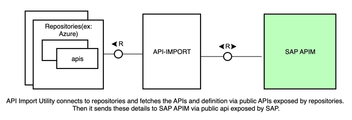
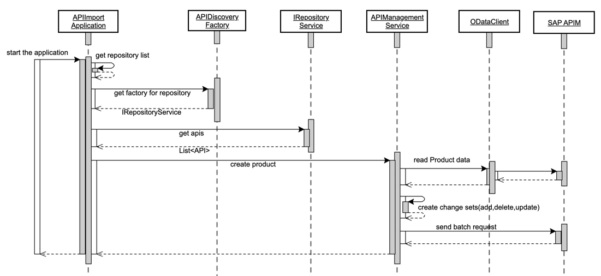

# API Import Utility for SAP API Management

The project is a tool to discover, import and publish APIs from various API repositories into SAP API Management.
It follows a "factory" design pattern, and is provided with an implementation for Microsoft Azure API Management.

For more information, see the blog published here: ...

## Building the utility

### Pre-requisites:

    a) Java 11 +
    b) Maven 3.9 +

### Build

    mvn clean install

This builds the utility in the `target/app` folder.

#### Update configuration files
Navigate to the `target/app/conf` folder.
The `conf` sub-folder contains the configuration files required to run the utility, as follows:

* `SAP_service_key.json` -
  Credentials required to access your API Management tenant. See the blog for details on how to create this file.

* `AAM_connection_details.json` -
  Credentials required to access the Azure API Management repository. See the blog for details on how to create this file.

* `AAM_product_description.json` -
  Descriptive strings, used to create a product in SAP API management. Normally no need to modify.

* `AAM_API_details.json` -
  URLs used to access the Azure API Management repository programmatically. Modify only if Microsoft changes these APIs.

* `SAP_Product_mapping.json` -
  Factory mapping. Contains one entry for the Azure API Management repository. Modify to support additional repositories.

### Run

Once you have updated the configuration files, navigate to the `target/app` folder, and enter:

    java -cp api-import.jar;lib/* com.apimgmt.gateway.APIImportApplication (Windows)
    java -cp "api-import.jar:lib/*"  com.apimgmt.gateway.APIImportApplication (mac os/Linux)

This will update the SAP API Management with the APIs reported by the Azure API Management.

Most users will want to integrate this utility in a periodically running workflow or CI/CD pipeline.

## Add support for an additional repository

Support for additional API repositories can be added, by the following steps:

    1. Implement the common "provider" interface (IRepositoryService)
    2. Add the implementation class details in the META-INF.services folder so that the service loader gets the implementation class from the classpath.
	3. add corresponding configuration files, following the provided "AAM" example.
	4. Copy the the additional "provider" jar file to the target/app/lib folder.

Here is a more detailed source code view of the API import flow:

### Logging

The log level can be modified in the `logback.xml` file available in the resources folder of smart discovery module.

### Check Style

Checkstyle files are available in the root folder of the project. The checkstyle can be run using the below command.

    mvn checkstyle:check
    
## How to obtain support
[Create an issue](https://github.com/SAP-samples/<repository-name>/issues) in this repository if you find a bug or have questions about the content.
 
For additional support, [ask a question in SAP Community](https://answers.sap.com/questions/ask.html).

## Contributing
If you wish to contribute code, offer fixes or improvements, please send a pull request. Due to legal reasons, contributors will be asked to accept a DCO when they create the first pull request to this project. This happens in an automated fashion during the submission process. SAP uses [the standard DCO text of the Linux Foundation](https://developercertificate.org/).

## License
Copyright (c) 2024 SAP SE or an SAP affiliate company. All rights reserved. This project is licensed under the Apache Software License, version 2.0 except as noted otherwise in the [LICENSE](LICENSE) file.

